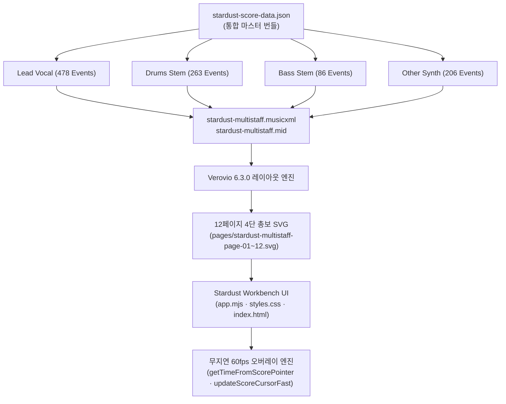

# Stardust 4-Part Multi-Staff Score Workbench 공유 가이드
**프로젝트**: Stardust (별먼지) 4부 총보/파트보 음악 작업대 및 인터랙티브 타임라인  
**접속 주소**: `http://127.0.0.1:8791/`  
**기준 버전**: R02 Multi-Staff Release (2026-09-12)  
**핵심 표준**: 160 BPM · 4/4 박자 · 121 마디 (181.50초) · 4개 스템 음원 동기화

---

## 1. 개요 및 설계 목적

본 작업대는 **Stardust** 곡의 동결 보컬 선율과 4개 스템 음원(Vocals, Drums, Bass, Other)을 단일 디지털 작업 환경(DAW)에서 총보(Grand Score) 및 파트보 악보와 1:1로 실시간 대조·검증하고, 마디/비트/가사 단위로 즉시 피드백을 남길 수 있도록 제작된 인터랙티브 웹 애플리케이션입니다.

- **4단 총보 (Grand Score)**: 보컬, 드럼, 베이스, 신스/건반 4개 보표가 브래킷으로 묶인 12페이지 연속 풀 스코어
- **파트보 (Stems Score)**: 각 파트별 3페이지 독립 보표 뷰
- **프리미어 프로 스타일 타임라인 & 악보 플레이헤드**: 악보 위와 하단 타임라인 어디서든 마우스 클릭·드래그로 즉각 스크러빙
- **원클릭 가사 피드백 드로어**: 플레이헤드가 머문 시점의 가사가 우측 에디터에 자동 바인딩되어 그 자리에서 즉시 수정/피드백 작성

---

## 2. 인터랙션 및 조작 가이드

### 2.1. 악보상 프리미어 플레이헤드 직접 조작
악보 위에 표시되는 **붉은색 수직 플레이헤드**는 단순 표시기가 아니라 직접 잡고 이동할 수 있는 인터랙티브 컨트롤러입니다.

| 조작 방식 | 동작 설명 |
|---|---|
| **플레이헤드 헤더 드래그** | 상단 역오각형 펜타곤 마커(`.score-playhead-handle`)를 마우스로 잡고 좌우로 드래그하여 탐색 |
| **악보 보표 임의 클릭** | 악보 마디나 보표 빈 공간을 클릭하면 해당 마디와 비트로 즉시 플레이헤드가 점프 |
| **연속 드래그 (`setPointerCapture`)** | 마우스를 누른 채 드래그하면 커서가 브라우저나 SVG 영역 밖으로 나가도 끊김 없이 연속 스크러빙 |
| **단(System) 간 자동 전환** | 마우스를 상하로 움직이면 해당 단(1단, 2단, 3단)의 마디로 세로 위치에 맞춰 자동 스냅 |
| **드래그 중 자동 일시정지** | 재생 중 플레이헤드를 잡으면 오디오가 일시정지되고, 마우스를 놓으면 해당 지점에서 즉시 이어 재생 |
| **75ms 오디오 스로틀링** | 고속 드래그 시 브라우저 오디오 디코더 병목을 막기 위해 75ms 단위로 지능형 스로틀링 적용 (60fps 무지연 화면 유지) |

### 2.2. 즉시 가사 피드백 & 드로어 자동 로드
- 악보 위에서 플레이헤드를 움직이면, **현재 마디/박자에 해당하는 가사 라인이 우측 인스펙터 드로어에 실시간 자동 로드**됩니다.
- 화면을 뒤적이거나 가사 목록을 일일이 찾을 필요 없이, 악보에서 이상한 부분을 짚으면 우측 창에서 해당 가사, 독음, 모라, 시작/종료 시간을 바로 확인하고 수정 초안(Draft)을 입력·저장할 수 있습니다.
- 특정 음표를 제자리에서 클릭(< 4px)하면 해당 음표의 정확한 시작 시간과 가사로 스냅됩니다.

### 2.3. 프리미어 프로 스타일 키보드 단축키

| 단축키 | 기능 | 비고 |
|---|---|---|
| `Space` | 재생 / 일시정지 (Play / Pause) | 프리미어 표준 재생 제어 |
| `S` | 정지 (Stop) | 재생 멈추고 시작점 복귀 |
| `←` / `→` | **0.1초 프레임 단위 미세 이동** | 영상 1프레임 단위의 정밀 탐색 |
| `Shift + ←` / `Shift + →` | **1.5초 (1마디) 점프** | 정확히 1마디 단위 고속 이동 |
| `Ctrl/Cmd + ←` / `Ctrl/Cmd + →` | **마디 시작점 스냅** | 가장 가까운 마디 바라인으로 스냅 |
| `Alt + ←` / `Alt + →` | **보컬 음표 단위 점프** | 이전/다음 가사 음표로 스냅 |
| `↑` / `↓` | **가사 구문(Phrase) 점프** | 29개 보컬 프레이즈 단위 점프 및 에디터 로드 |
| `[` / `]` | 구간 반복 A / B 지점 설정 | 현재 재생 헤드 위치를 루프 구간으로 설정 |
| `L` | 루프 토글 (Loop On / Off) | A-B 구간 또는 전체 반복 재생 |
| `PageUp` / `PageDown` | 이전 / 다음 악보 페이지 전환 | 총보 12페이지 / 파트보 3페이지 |
| `+` / `-` / `0` | 악보 줌 인 / 줌 아웃 / 100% 맞춤 | SVG 스케일 벡터 줌 |

---

## 3. 음악 데이터 및 시스템 아키텍처



### 3.1. 트랙 구성 및 파트별 음역 스펙
1. **Vocals (보컬 메인 라인)**
   - 이벤트 수: 478개 (가사 음절 279개, 묵음 199개, 연장음 50개)
   - 가사 구문: 29개 라인 (Intro, Verse 1, Pre-Chorus, Chorus, Verse 2, Bridge, Outro)
   - 음역: A#3 ~ G5
   - 첫 음표 시작: 13.162초 (Bar 9 Beat 4.1)
2. **Drums (드럼 타악기 라인)**
   - 이벤트 수: 263개 타격 이벤트
   - 세부 구성: Kick 70회 (F4/MIDI 36), Snare 75회 (C5/MIDI 40), HiHat 118회 (G5/MIDI 42)
3. **Bass (베이스 라인)**
   - 이벤트 수: 86개 피치 이벤트
   - 음역: F1 (MIDI 29) ~ G3 (MIDI 55)
4. **Other (신스 / 키보드 라인)**
   - 이벤트 수: 206개 피치 이벤트
   - 음역: C3 (MIDI 48) ~ D#6 (MIDI 87)

### 3.2. 타임라인 통합 기준
- **전체 마디 수**: 121 마디
- **마디당 길이**: 160 BPM, 4/4 박자 $\implies$ $60 / 160 \times 4 = 1.50$초
- **총 악보 길이**: $121 \times 1.50\text{s} = 181.50$초
- **스템 오디오 길이**: $167.392$초 (112마디까지 실제 음원 연주, 113~121마디는 아웃트로 여운 구간으로 오디오는 끝단에 클램핑되고 악보와 타임라인은 121마디 끝까지 정상 추적)

---

## 4. 로컬 구동 및 검증 명령어

### 4.1. 서비스 실행
워크벤치 서버는 로컬 8791 포트에서 백그라운드로 구동 중입니다.
```bash
# 워크벤치 디렉토리 이동
cd /Users/macpro/Documents/Codex/2026-09-09/1-2-flash-3-bgm-4/work/antigravity-runs/stardust-r02-multistaff-score-20260912

# 서버 실행 (이미 8791 포트에서 데몬으로 가동 중)
python3 server.py --port 8791
```
브라우저에서 `http://127.0.0.1:8791/` 접속.

### 4.2. 자동 검증 스위트 실행
```bash
# 1. 자바스크립트 구문 및 정적 오류 검사
node --check app.mjs

# 2. 상태 전이, 인바리언트 및 불변식 16개 테스트
node test_state.mjs

# 3. HTTP 서버 엔드포인트 및 멀티파트/범위 요청 15개 테스트
python3 test_server.py

# 4. 데몬 가동 확인
curl -s -I http://127.0.0.1:8791/index.html
```

---

## 5. 주요 파일 경로

- **애플리케이션 메인 로직**: [`app.mjs`](file:///Users/macpro/Documents/Codex/2026-09-09/1-2-flash-3-bgm-4/work/antigravity-runs/stardust-r02-multistaff-score-20260912/app.mjs)
- **UI 및 플레이헤드 스타일**: [`styles.css`](file:///Users/macpro/Documents/Codex/2026-09-09/1-2-flash-3-bgm-4/work/antigravity-runs/stardust-r02-multistaff-score-20260912/styles.css)
- **메인 뷰 마크업**: [`index.html`](file:///Users/macpro/Documents/Codex/2026-09-09/1-2-flash-3-bgm-4/work/antigravity-runs/stardust-r02-multistaff-score-20260912/index.html)
- **순수 상태 머신 모듈**: [`state.mjs`](file:///Users/macpro/Documents/Codex/2026-09-09/1-2-flash-3-bgm-4/work/antigravity-runs/stardust-r02-multistaff-score-20260912/state.mjs)
- **단위 테스트 스위트**: [`test_state.mjs`](file:///Users/macpro/Documents/Codex/2026-09-09/1-2-flash-3-bgm-4/work/antigravity-runs/stardust-r02-multistaff-score-20260912/test_state.mjs)
- **통합 서버 테스트**: [`test_server.py`](file:///Users/macpro/Documents/Codex/2026-09-09/1-2-flash-3-bgm-4/work/antigravity-runs/stardust-r02-multistaff-score-20260912/test_server.py)
- **통합 스코어 번들 데이터**: [`stardust-score-data.json`](file:///Users/macpro/Documents/Codex/2026-09-09/1-2-flash-3-bgm-4/work/antigravity-runs/stardust-r02-multistaff-score-20260912/stardust-score-data.json)
- **4부 총보 MusicXML**: [`stardust-multistaff.musicxml`](file:///Users/macpro/Documents/Codex/2026-09-09/1-2-flash-3-bgm-4/work/antigravity-runs/stardust-r02-multistaff-score-20260912/stardust-multistaff.musicxml)
- **총보 SVG 12페이지**: [`pages/stardust-multistaff-page-01.svg`](file:///Users/macpro/Documents/Codex/2026-09-09/1-2-flash-3-bgm-4/work/antigravity-runs/stardust-r02-multistaff-score-20260912/pages/stardust-multistaff-page-01.svg) ~ `page-12.svg`
- **솔 맥스 감사 게이트 규격**: [`CODEX_SOL_MAX_REVIEW_GATE.md`](file:///Users/macpro/Documents/Codex/2026-09-09/1-2-flash-3-bgm-4/work/antigravity-runs/stardust-r02-multistaff-score-20260912/CODEX_SOL_MAX_REVIEW_GATE.md)
